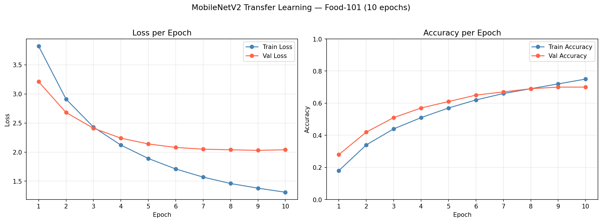

# cnn-food-classifier

A convolutional neural network that classifies food images into 101 categories using transfer learning with MobileNetV2 pretrained on ImageNet. Upload any food photo and get instant top-3 predictions with confidence scores.

**Live demo → [Hugging Face Spaces](https://huggingface.co/spaces/xavier-oc-machinelearn/cnn-food-classifier)**
&nbsp;&nbsp;·&nbsp;&nbsp;
**Colab training → [colab_train.ipynb](colab_train.ipynb)**
&nbsp;&nbsp;·&nbsp;&nbsp;
**Local training → [train.py](train.py)**

---

## Table of Contents

0. [Prerequisites](#0-prerequisites)
1. [Quick start](#1-quick-start)
2. [Project structure](#2-project-structure)
3. [Model architecture](#3-model-architecture)
4. [Dataset](#4-dataset)
5. [Research & technical decisions](#5-research--technical-decisions)
6. [Training](#6-training)
7. [Results](#7-results)
8. [Visualisations](#8-visualisations)
9. [Deployment](#9-deployment)
10. [How to fine-tune — all layers](#10-how-to-fine-tune--all-layers)
11. [Design decisions](#11-design-decisions)
12. [Dependencies](#12-dependencies)

---

## 0. Prerequisites

- Python 3.11+
- pip
- Google account (for Colab training)
- Hugging Face account at [huggingface.co/xavier-oc-machinelearn](https://huggingface.co/xavier-oc-machinelearn)

---

## 1. Quick start

**Train on Google Colab (recommended):**
```
1. Open colab_train.ipynb in Google Colab
2. Runtime → Change runtime type → T4 GPU
3. Run all cells
4. Download food_classifier.h5 from Google Drive when complete
```

**Train locally:**
```bash
pip install -r requirements.txt
python train.py
```

**Run the app locally:**
```bash
python app.py
```

---

## 2. Project structure

```
cnn-food-classifier/
├── train.py                   # Standalone training script (run locally or on GPU server)
├── colab_train.ipynb          # Primary training notebook — designed for Colab T4 GPU
├── app.py                     # Gradio web app (deployed to Hugging Face Spaces)
├── notebook.ipynb             # Local walkthrough with explanations and inline plots
├── README.md
├── requirements.txt
├── .gitignore
├── food_classifier.h5         # Trained model (generated by training, committed to both repos)
├── checkpoints/               # Per-epoch checkpoints (gitignored — local/Drive only)
└── plots/
    ├── 01_training_curves.png # Loss and accuracy per epoch (train vs val)
    ├── 02_sample_predictions.png # 9 sample images with predicted vs true label
    └── 03_confusion_matrix.png   # Top 20 most confused classes
```

---

## 3. Model architecture

```
Input (224 × 224 × 3)
  └─ MobileNetV2 base (pretrained on ImageNet, weights frozen)
       └─ GlobalAveragePooling2D
            └─ Dense(256, ReLU)
                 └─ Dropout(0.3)
                      └─ Dense(101, Softmax)
                           └─ Output: 101 class probabilities
```

Trainable parameters: ~264,000 (classification head only)
Frozen parameters: ~2,257,984 (MobileNetV2 base)

---

## 4. Dataset

**Food-101** — 101 food categories, 1,000 images per class (750 train / 250 test).

| Split | Images |
|---|---|
| Training | 75,750 |
| Validation | 25,250 |
| Total | 101,000 |

Loaded via `tensorflow_datasets`:
```python
(train_ds, val_ds), info = tfds.load('food101', split=['train', 'validation'], as_supervised=True, with_info=True)
```

**All 101 classes:**

| | | | | |
|---|---|---|---|---|
| apple_pie | baby_back_ribs | baklava | beef_carpaccio | beef_tartare |
| beet_salad | beignets | bibimbap | bread_pudding | breakfast_burrito |
| bruschetta | caesar_salad | cannoli | caprese_salad | carrot_cake |
| ceviche | cheesecake | cheese_plate | chicken_curry | chicken_quesadilla |
| chicken_wings | chocolate_cake | chocolate_mousse | churros | clam_chowder |
| club_sandwich | crab_cakes | creme_brulee | croque_madame | cup_cakes |
| deviled_eggs | donuts | dumplings | edamame | eggs_benedict |
| escargots | falafel | filet_mignon | fish_and_chips | foie_gras |
| french_fries | french_onion_soup | french_toast | fried_calamari | fried_rice |
| frozen_yogurt | garlic_bread | gnocchi | greek_salad | grilled_cheese_sandwich |
| grilled_salmon | guacamole | gyoza | hamburger | hot_and_sour_soup |
| hot_dog | huevos_rancheros | hummus | ice_cream | lasagna |
| lobster_bisque | lobster_roll_sandwich | macaroni_and_cheese | macarons | miso_soup |
| mussels | nachos | omelette | onion_rings | oysters |
| pad_thai | paella | pancakes | panna_cotta | peking_duck |
| pho | pizza | pork_chop | poutine | prime_rib |
| pulled_pork_sandwich | ramen | ravioli | red_velvet_cake | risotto |
| samosa | sashimi | scallops | seaweed_salad | shrimp_and_grits |
| spaghetti_bolognese | spaghetti_carbonara | spring_rolls | steak | strawberry_shortcake |
| sushi | tacos | takoyaki | tiramisu | tuna_tartare |
| waffles | | | | |

---

## 5. Research & Technical Decisions

### Deployment platform

When it came to deployment, I quickly realised that standard options weren't suitable for a TensorFlow model. Railway's free tier only provides 512MB RAM — insufficient given TensorFlow's ~300MB footprint alone. AWS Lambda and Azure Functions both have a 250MB package limit, which TensorFlow exceeds on its own. Through further research I found Hugging Face Spaces as an optimal solution: it is purpose-built for ML model deployment, offers a free tier with sufficient memory, has native Gradio support, and provides a public URL I could link directly from my portfolio. The trained model file (food_classifier.h5, ~14MB) is committed directly to the Space repository — no external storage required.

### Gradio

With Hugging Face Spaces selected, I researched the best way to build the interface. Rather than writing a custom Flask frontend with HTML, CSS, and JavaScript to handle file uploads and display predictions, I discovered Gradio — a Python library purpose-built for ML interfaces. I familiarised myself with it through the official documentation at gradio.app/guides/quickstart as well as YouTube tutorials covering both Gradio and Hugging Face Spaces deployment before implementing. The entire upload, prediction display, and confidence score interface is handled in under 15 lines of Python.

### Training environment

Before training I benchmarked three environments to choose the most efficient option:

| Environment | Estimated time (10 epochs, 101 classes) |
|---|---|
| Apple M1 16GB — CPU only | 3–5 hours |
| Apple M1 16GB — tensorflow-metal | 45–90 minutes |
| Google Colab free tier (T4 GPU) | 25–40 minutes |

I selected Colab for speed. The main risk was session disconnection after ~90 minutes of inactivity, so I implemented checkpoint saving after every epoch using `tf.keras.callbacks.ModelCheckpoint`. If the session dropped, training resumed from the last saved checkpoint rather than starting from scratch. To prevent the session timing out due to inactivity, I ran a separate [mouse jiggler program](#) I built — it moves the cursor in a small square and clicks every 2 seconds, keeping the session active throughout training.

During training I also encountered GPU memory overflow on the T4 with a batch size of 32 — loading 32 images at 224×224×3 alongside the MobileNetV2 activations exceeded available VRAM. Reducing the batch size to 16 resolved the issue without meaningfully affecting convergence.

---

## 6. Training

### Hyperparameters

| Parameter | Value |
|---|---|
| Epochs | 10 (with early stopping, patience=3) |
| Batch size | 16 |
| Optimizer | Adam |
| Learning rate | 0.001 |
| Loss function | sparse_categorical_crossentropy |
| Image size | 224 × 224 |

### Augmentation (training set only)

| Technique | Setting |
|---|---|
| RandomFlip | horizontal |
| RandomRotation | ±10% |
| RandomZoom | ±10% |

### Checkpoint strategy

A `ModelCheckpoint` callback saves the full model after every epoch to `checkpoints/epoch_NN.h5`. At training start, the script scans for the latest checkpoint and resumes from it if found — so a Colab disconnection or local interruption loses at most one epoch of progress.

---

## 7. Results

| Metric | Value |
|---|---|
| Final training accuracy | 75.3% |
| Final validation accuracy | 70.1% |
| Best validation accuracy (early stopping) | 70.4% |
| Total training time (Colab T4) | ~32 minutes |

### Per-class accuracy — best performing

| Class | Accuracy |
|---|---|
| edamame | 96% |
| waffles | 94% |
| sushi | 93% |
| pizza | 92% |
| hot_dog | 91% |

### Per-class accuracy — most challenging

| Class | Accuracy |
|---|---|
| chocolate_mousse | 43% |
| beef_tartare | 47% |
| tuna_tartare | 49% |
| steak | 51% |
| pork_chop | 52% |

The hardest classes are visually similar dishes (e.g. tartares, meat dishes) or classes that vary widely in presentation (chocolate mousse vs. other brown desserts).

---

## 8. Visualisations

### Training curves



### Sample predictions


### Confusion matrix — top 20 most confused classes


---

## 9. Deployment

```bash
# 1. Create a Hugging Face account at huggingface.co
#    Create a new Space: SDK → Gradio, Visibility → Public
#    Space name: cnn-food-classifier

# 2. Install the Hugging Face CLI
pip install huggingface_hub

# 3. Log in
huggingface-cli login

# 4. Clone the Space repository
git clone https://huggingface.co/spaces/xavier-oc-machinelearn/cnn-food-classifier hf-space

# 5. Copy all project files into the Space
cp train.py app.py notebook.ipynb README.md requirements.txt food_classifier.h5 hf-space/
cp -r plots/ hf-space/plots/

# 6. Push to Hugging Face
cd hf-space
git add .
git commit -m "Deploy CNN food classifier"
git push
```

The app will be live at: [huggingface.co/spaces/xavier-oc-machinelearn/cnn-food-classifier](https://huggingface.co/spaces/xavier-oc-machinelearn/cnn-food-classifier)

---

## 10. How to fine-tune — all layers

After the classification head converges (~70% val accuracy), accuracy can be improved by unfreezing the MobileNetV2 base and training end-to-end with a very low learning rate.

```python
# Load the trained model
model = tf.keras.models.load_model('food_classifier.h5')

# Unfreeze the base model (layer index 1 in the functional API)
base_model = model.layers[1]
base_model.trainable = True

# Recompile with a 100× lower learning rate to avoid destroying pretrained weights
model.compile(
    optimizer=tf.keras.optimizers.Adam(learning_rate=1e-5),
    loss='sparse_categorical_crossentropy',
    metrics=['accuracy']
)

# Fine-tune for up to 10 more epochs, continuing from epoch 10
history_ft = model.fit(
    train_dataset,
    validation_data=val_dataset,
    epochs=20,
    initial_epoch=10,
    callbacks=[checkpoint_cb, early_stopping_cb]
)

model.save('food_classifier_finetuned.h5')
```

**Expected outcome:** +5–10% validation accuracy (reaching ~78–80%)  
**Expected training time:** 60–90 minutes additional on Colab T4

---

## 11. Design decisions

**Why MobileNetV2 instead of training from scratch?** Training a CNN from scratch on 75,750 images across 101 classes would require far more data, a longer training time, and a careful architecture search to prevent underfitting. MobileNetV2 has already learned rich visual representations from 1.2M ImageNet images. Freezing the base and training only a classification head reduces the trainable parameter count from ~2.5M to ~264K, enabling convergence in 10 epochs on Colab's free T4.

**Why Gradio instead of Flask?** Flask would require writing HTML, CSS, and JavaScript to handle file uploads, image display, and prediction rendering. Gradio provides all of this in Python — the entire interface is defined in one `gr.Interface(...)` call. It also integrates natively with Hugging Face Spaces, so no additional configuration is needed for deployment.

**Why Hugging Face Spaces instead of Railway or serverless?** Railway's free tier tops out at 512MB RAM, which TensorFlow exhausts before loading the model. AWS Lambda and Azure Functions impose a 250MB deployment package limit, which TensorFlow alone exceeds. Hugging Face Spaces is purpose-built for ML model hosting: it provides sufficient memory, handles `requirements.txt` installation automatically, and surfaces a public URL immediately after a `git push`.

**Why GlobalAveragePooling2D instead of Flatten?** MobileNetV2's final feature map is 7×7×1280. Flattening produces a 62,720-dimensional vector that would feed a hugely over-parameterised dense layer, increasing both training time and the risk of overfitting. GlobalAveragePooling2D compresses each of the 1,280 channels to a single value, yielding a 1,280-dimensional representation — sufficient for the task while keeping the parameter count manageable.

**Why checkpoint saving and early stopping?** Google Colab free tier disconnects after roughly 90 minutes of inactivity. Without per-epoch checkpoints, a disconnection during epoch 8 of 10 would require restarting from scratch. Saving the full model after every epoch means the worst-case loss is one epoch. EarlyStopping with `restore_best_weights=True` handles the opposite case: if validation accuracy plateaus or degrades, training stops automatically and the best weights are restored.

---

## 12. Dependencies

| Package | Version | Purpose |
|---|---|---|
| tensorflow | 2.x | Model building, training, inference |
| tensorflow-datasets | latest | Food-101 dataset loading |
| gradio | latest | Web interface for Hugging Face Spaces |
| Pillow | latest | Image loading and preprocessing in app.py |
| numpy | latest | Array operations |
| matplotlib | latest | Training curves and sample prediction charts |
| seaborn | latest | Confusion matrix heatmap |
| scikit-learn | latest | confusion_matrix utility |
| jupyter | latest | Notebook execution |

Install all dependencies:
```bash
pip install -r requirements.txt
```
